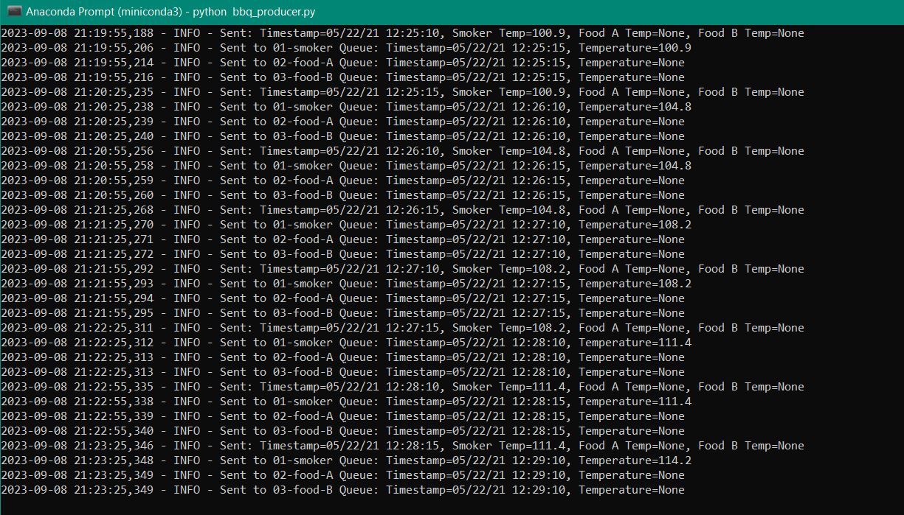
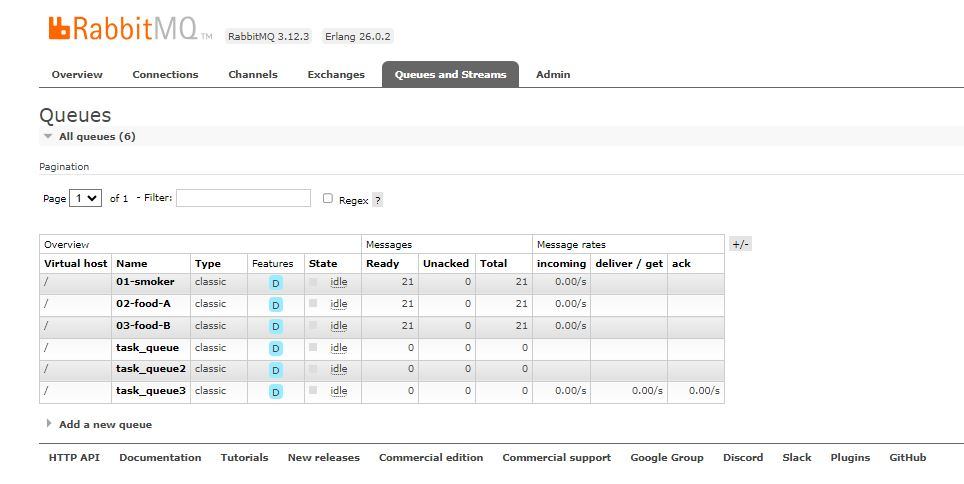

# streaming-05-smart-smoker

## Requirements

PACKAGES:

Pika
Sys
Webbrowser
CSV
Time
Logging

FILES:

smoker-temps.csv

## Notes

Overall, this script is very similar to v2_emitter_of_tasks.py in Module 4, as well as my own version of that, v3_emitter_of_tasks.py.

However, I did change some names of things. For example, the original function that opens the RabbitMQ admin site has been renamed to "admin()" for simplicity, per the instructions found here: https://nwmissouri.instructure.com/courses/54849/pages/module-5-dot-2-guided-producer-implementation?wrap=1 

In my module 4 assignment, I had a function to send a message to a queue, and one to open and read a csv. The same general principle applies here. However, most of the heavy lifting is being done by a function called "main()", which was named by following the directions in the link above. The main() function deletes existing queues before starting anything else, declares new queues, reads values from each column and row in the specified CSV file and assigns those values to variables, accesses a custom function to send messages to queues based on which column is being read from the csv, and finally closes itself out once finished. There is a lot going on here, but again, most of this is standard from our other assignment, save for some of the reading of the CSV file. However, we have seen the "with open()" convention in other classes, so this is nothing new. The assignment instruction specifically described issues with the values in the CSV file being floats, while the messages needed to be strings. To mitigate this, I read those values as floats and then added the line "if row [1] else None " to handle any missing values so as not to cause problems with the floats. Per the instructions, I also used the time.sleep() function to send only one record every 30 seconds. This falls with in the overall "with open()" loop to ensure that each message (row in the CSV file) takes 30 seconds to send.

Before the main function, I defined a custom function called send_message(). This takes as arguments the channel, the queue name, the timestamp, and the temperature, all of which are defined in the main() function. Each queue name is associated with the different temperature types (columns in the CSV) that the smoker reads, so each temperature goes to it's respective queue. Other than comments, there are only 2 lines of code here that we have seen before, channel.basic_publish() and logging.info(). These tell the program what messages should go where and what should be displayed to the user.

To interrupt and stop the program, type CTRL+C.

## Screenshots

